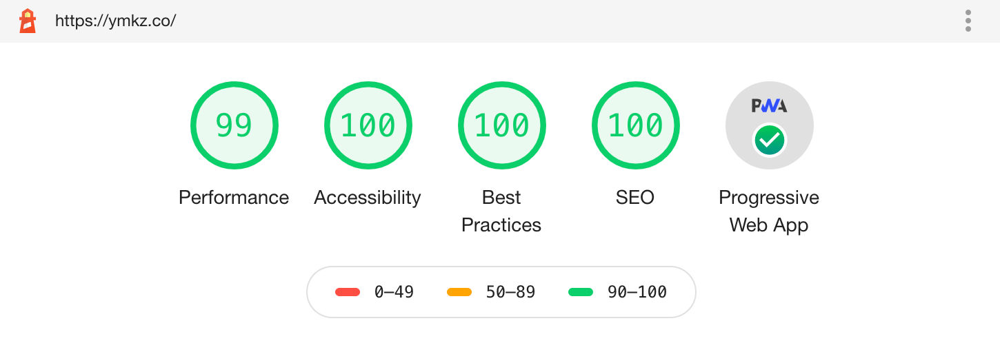

<div>
  
  <h1>ymkz.co</h1>
</div>

> ymkz's website

<p>
  <a href="https://github.com/ymkz/ymkz.co" target="_blank" rel="noopener noreferrer">
    
  </a>
  <a href="https://zeit.co/ymkz/ymkz.co" target="_blank" rel="noopener noreferrer">
    
  </a>
  <a href="https://github.com/Microsoft/TypeScript" target="_blank" rel="noopener noreferrer">
    
  </a>
  <a href="https://prettier.io" target="_blank" rel="noopener noreferrer">
    
  </a>
  <a href="https://eslint.org" target="_blank" rel="noopener noreferrer">
    
  </a>
  <a href="https://stylelint.io" target="_blank" rel="noopener noreferrer">
    
  </a>
  <a href="https://emotion.sh" target="_blank" rel="noopener noreferrer">
    
  </a>
  <a href="https://twitter.com/ymkzly" target="_blank" rel="noopener noreferrer">
    
  </a>
</p>

## Install

```sh
yarn install
```

## Usage

```sh
yarn dev
```

## Audits



## Author

👤 **ymkz**

- Twitter: [@ymkzly](https://twitter.com/ymkzly)
- Github: [@ymkz](https://github.com/ymkz)

## Show your support

Give a ⭐️ if this project helped you!

## License

Copyright © 2020 [ymkz](https://github.com/ymkz).

---

_Logo Icon made by [Freepik](https://www.flaticon.com/authors/freepik) from www.flaticon.com_  
_This README was generated with ❤️ by [readme-md-generator](https://github.com/kefranabg/readme-md-generator)_
